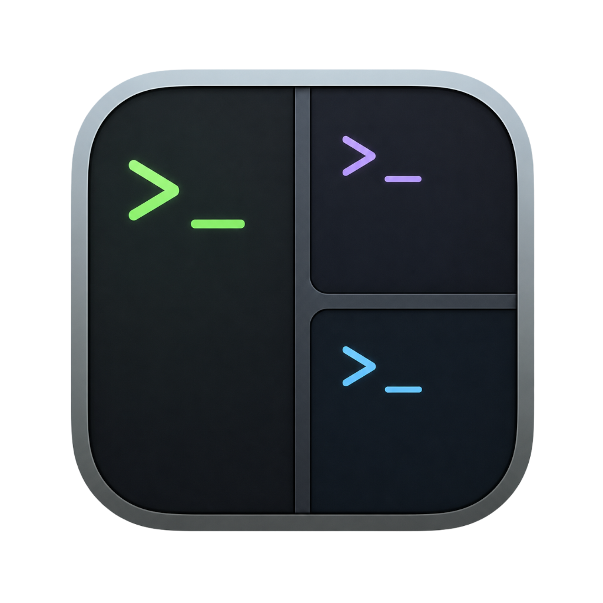
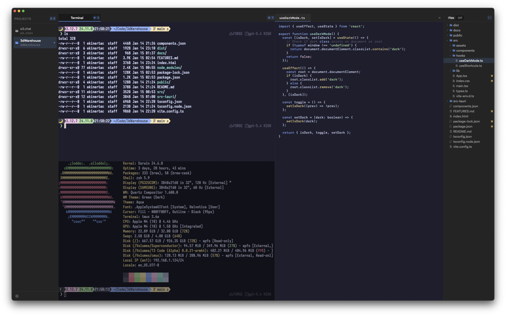

<div align="center">
  
  <h1>Agamon</h1>
  <p>A terminal multiplexer and file editor for macOS — built for developers who live in the terminal.</p>

  <a href="https://github.com/ekinertac/agamon/releases/latest">
    
  </a>
  
  
</div>

---



## Features

**Terminal**
- Split panes horizontally and vertically — as many as you need
- tmux integration: sessions survive tab switches and app restarts
- Per-pane attention indicators (BEL / bell)
- Zoom any pane to full-screen with ⌘⇧↩
- 50+ built-in themes with live preview

**Editor**
- Typora-style live markdown rendering
- Syntax highlighting for Swift, TypeScript, Python, Rust, and more
- Shift+Tab de-indent, line wrap toggle, native find bar (⌘F)
- Editor files restored across launches

**File panel**
- Git-aware file tree with status badges
- Unified diff viewer
- Resizable sidebar

**Workflow**
- Command palette (⌘P)
- Context-aware shortcuts: ⌘1/2 switches file panel tabs when focused, terminal tabs otherwise
- Spatial pane navigation with ⌃⌥ arrow keys
- Project switching with persistent tab layouts

## Download

Grab the latest build from [Releases](https://github.com/ekinertac/agamon/releases) — unzip and drop `Agamon.app` into `/Applications`.

Signed and notarized — no Gatekeeper prompts.

## Build from source

**Requirements:** macOS 14+, Swift 5.9+, Xcode command-line tools

```bash
git clone https://github.com/ekinertac/agamon
cd agamon

# Generate the app icon (requires icon.png in the project root)
make icon

# Build and sign with ad-hoc certificate
make bundle

# Open
open Agamon.app
```

## Themes

Agamon ships with 50+ themes in [Ghostty format](https://ghostty.org/docs/config/reference#theme). Drop additional `.conf` theme files into:

```
~/.config/agamon/themes/
```

and restart the app — they appear immediately in Settings → Appearance.

## Requirements

- macOS 14 Sonoma or later
- Apple Silicon or Intel
